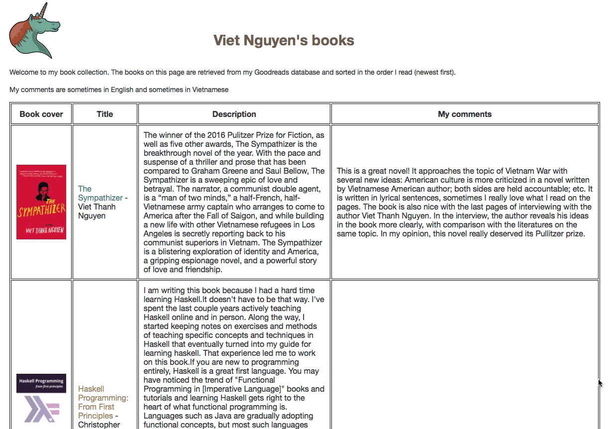

# goodreads-books
A web app that retrieves a list of books from Goodreads and displays it in a more compact, readable format. 

## Features 

- Connect to Goodreads to get book data.
- Parse the response from Goodreads to get the necessary fields. 
- Use Snap to serve a web page displaying the book details. 

## How to run 

The project is compiled
using [Stack](https://docs.haskellstack.org/en/stable/README/) build
tool. After installing it, compile the app: 

```sh 
$ stack install 
``` 

This will install the app into `~/.local/bin`. Be sure that it is in
your system path, then run the app: 

```sh
$ goodreads-books -p 8000
```

Then the app can be accessed at `localhost:8000`.

There are also instructions on how to run the app on Heroku. See more
at `notes.md`. 

## Others

For notes about development process, see `notes.md`. 

For a detailed project log, see `project-log.md`.


## Demo 



